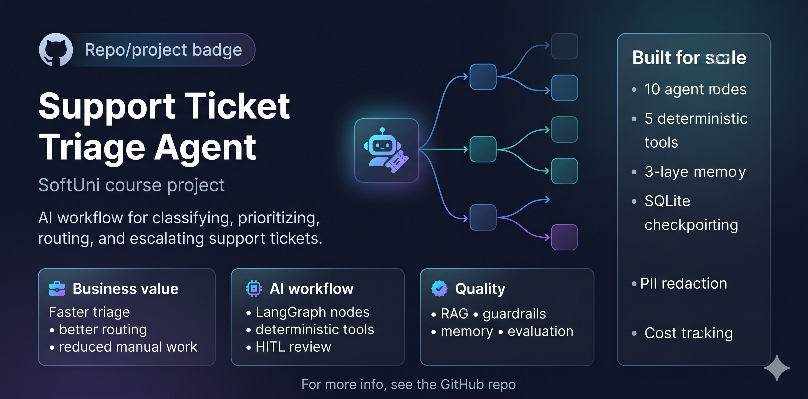
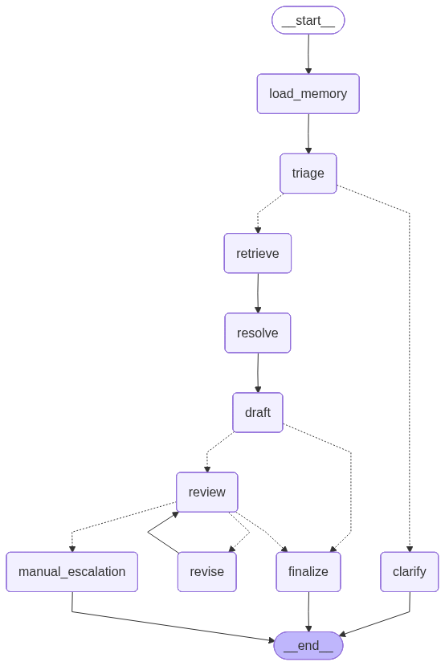

# Individual Course Project
### SofUni · AI Agents and Workflows for Developers · May 2026

**Author:** Yasen Ivanov


A production-inspired AI support triage system built on **LangGraph**, **LangChain**, and **OpenAI gpt-4o-mini**.
It demonstrates how autonomous agents, deterministic business policies, and Human-in-the-Loop (HITL)
supervision can be composed into a reliable, auditable, and personalisable support solution.

**Notebook:** `support_ticket_triage_v1.ipynb`  
**Data:** `project_data.json` — loaded at runtime from GitHub (KB articles · account contexts · routing rules · test cases)  
**Persistence:** Two SQLite databases — `workflow_state.sqlite` (graph checkpoints) · `memory_store.sqlite` (long-term memory)

Includes **10 unit tests** (isolated `:memory:` SQLite database for memory functions + all 5 tools) and **7 end-to-end integration tests** validating HITL paths and workflow correctness.

---

## 🌟 What Makes This System Different

| Feature | Detail |
|---|---|
| **Stateful graph** | LangGraph `StateGraph` with SQLite checkpointer — graph state survives kernel restarts |
| **API-forced tool call** | `routing_llm.bind_tools([route_policy_lookup], tool_choice="required")` — the model *must* call the routing tool; enforced at the OpenAI API level, not just a prompt hint |
| **3-layer memory** | Short-term (tiktoken-trimmed messages) · Long-term (namespaced SQLite) · RAG (FAISS over 17 KB articles) |
| **Model-as-Judge** | After the scorer, `gpt-4o-mini` grades each reply on groundedness · tone · completeness (1–5) with a pass/partial/fail verdict |
| **Unit tests** | 10 isolated `assert`-based tests on memory functions + all 5 tools — zero side effects on production DB |
| **Interactive Demo** | Live HITL test harness — full chat loop with rich display helpers for end-to-end scenario exploration |
| **Cost Tracking** | OpenAI callback integration — per-workflow cost allocation (input tokens · output tokens · total spend · model breakdown) |
| **Guardrails** | PII redaction (email, phone, SSN, card) + forbidden-topic blocking before graph invocation |

---

## 🏗️ Architecture at a Glance

| Layer | Component | Detail |
|---|---|---|
| **Framework** | LangGraph `StateGraph` | SQLite checkpointer, cyclical graph, resumable from interrupts |
| **LLM Stack** | `gpt-4o-mini` (OpenAI) | `triage_llm` · `plan_llm` · `routing_llm` · `base_llm` |
| **Nodes** | 10 agent nodes | Memory Loader · Triage · Clarify · Retrieval · Resolution · Draft · Review (HITL, conditional) · Revise · Finalize · Manual Escalation |
| **Tools** | 5 deterministic tools | `search_kb` · `lookup_account_context` · `detect_escalation_risk` · `priority_score` · `route_policy_lookup` |
| **Memory** | 3 layers | Short-term (messages + tiktoken trim) · Long-term (SQLite namespaced) · RAG (FAISS / 17 KB articles) |
| **API-Forced Tool Call** | `routing_llm.bind_tools` | Enforced at OpenAI API level with `tool_choice="required"` on `route_policy_lookup` |
| **Conditional HITL** | `after_draft_route()` | Routes high-risk tickets (critical/high priority, escalation flags, churn/complaint/unknown) to review; low-risk skip to finalize |
| **Evaluation** | Scorer + Model-as-Judge | Deterministic checks + `gpt-4o-mini` rubric (groundedness · tone · completeness) |
| **Tests** | 7 end-to-end + 10 unit | HITL paths: approve · revise · escalate_manually · auto-finalize · clarify; isolated `:memory:` DB for units |
| **Interactive Demo** | Live test harness | Full HITL chat loop with rich display helpers for end-to-end scenario exploration |
| **Cost Tracking** | OpenAI callback | Per-workflow cost allocation: input tokens · output tokens · total spend · model breakdown |

---

## 🔄 Workflow Architecture


```
user_request
     │
     ▼
[apply_guardrails]  ← PII redact + forbidden-topic block
     │
     ▼
[load_memory_node]  ← pre-load SQLite preferences/history into state
     │
     ▼
[triage_node]  ← gpt-4o-mini structured output → TriageOutput
     │
     ├─ ≥2 missing fields ──► [clarify_node] ──► END
     │
     ▼
[retrieval_node]  ← 4 deterministic tools
     │              search_kb · lookup_account_context
     │              detect_escalation_risk · priority_score
     ▼
[resolution_node]  ← Step 1: routing_llm.bind_tools (API-forced tool call)
     │               Step 2: plan_llm structured output → ResolutionPlan
     ▼
[draft_node]  ← gpt-4o-mini, tone from long-term memory
     │
     ▼
[after_draft_route]  ← Conditional gate (high-risk → HITL, low-risk → auto-finalize)
     │
     ├─ HIGH RISK ──► [review_node]  ◄────── HITL interrupt ────────► human decision
     │                    │                                                 │
     │                    ├── approve ─────────────────────────► [finalize_node]
     │                    │                                                 │
     │                    ├── revise: <feedback> ──► [revise_node] ──► back to review
     │                    │
     │                    └── escalate_manually ──► [manual_escalation_node] ──► END
     │
     └─ LOW RISK ──► [finalize_node] ──► END
```

**Key Routing Decision:** After `draft_node`, tickets are evaluated for:
- High priority (critical/high)
- Escalation risk flag
- Risky categories (cancellation, complaint, unknown)
→ HIGH RISK = stop at `review_node` for human approval  
→ LOW RISK = skip review, proceed to `finalize_node`

---

## 🧠 Three-Layer Memory Architecture

### 1. Short-Term Memory (Thread State)
- **Mechanism:** `messages` field in `TicketState` — a list of `{role, content}` dicts.
- **Trimming:** `prepare_messages()` uses **tiktoken** (`cl100k_base`) to count tokens and keep only the most recent messages within `MSG_TRIM_MAX_TOKENS` (default 1800) before every LLM call.
- **Scope:** One graph thread — not shared across conversations.

### 2. Long-Term Memory (Persistent Profiles)
- **Mechanism:** Namespaced `memory_store` SQLite table — `PRIMARY KEY (namespace, key)`.
- **Namespaces:** `user:<account_id>:preferences` · `user:<account_id>:history` · `global:routing_preferences` · `global:tone_rules`
- **Read:** `resolution_node` and `draft_node` read preferences/history before acting.
- **Write:** `finalize_node` writes back updated tone, escalation flag, last category, and last known route.
- **Seed:** `seed_memory_defaults()` pre-loads defaults from `project_data.json` on startup using `INSERT OR IGNORE`.

### 3. RAG Grounding Memory (FAISS)
- **Mechanism:** 17 KB articles from `project_data.json` → `Document` chunks (500 chars, 100 overlap) → FAISS vector store with `text-embedding-3-small`.
- **Retrieval:** Top-4 chunks per query (`RETRIEVER_TOP_K = 4`).
- **Enforcement:** Agents may not promise refunds, credits, or actions unless the KB evidence supports them.

---

## 🤖 Agent Nodes (10)

| # | Node | Role | LLM |
|---|---|---|---|
| 1 | `load_memory_node` | Extracts `account_id` via regex, pre-loads 4 namespaces into `memory_context` | — |
| 2 | `triage_node` | Classifies ticket → `TriageOutput` (category · subcategory · priority · sentiment · escalation · missing_info · entities) | `triage_llm` (structured output) |
| 3 | `clarify_node` | Generates a clarification request when ≥2 fields are missing | — |
| 4 | `retrieval_node` | Calls 4 tools; reconciles LLM vs tool priority with `PRIORITY_RANK` | — |
| 5 | `resolution_node` | **Two-step**: forced tool call via `routing_llm.bind_tools` → structured plan via `plan_llm` | `routing_llm` + `plan_llm` |
| 6 | `draft_node` | Writes tone-aware, grounded customer reply; reads tone from long-term memory | `base_llm` |
| 7 | `review_node` | HITL interrupt — pauses for approve / revise / escalate_manually | — |
| 8 | `revise_node` | Refines draft per reviewer feedback | `base_llm` |
| 9 | `finalize_node` | Approves draft; writes 4 facts back to long-term memory | — |
| 10 | `manual_escalation_node` | Generates escalation message; marks `route_to_team=human_specialist` | — |

---

## 🛠️ Deterministic Tools (5)

| Tool | Type | Description |
|---|---|---|
| `search_kb` | FAISS retriever | Top-K vector search over 17 approved KB articles |
| `lookup_account_context` | Dict lookup | CRM-style fetch of subscription tier, billing status, open tickets |
| `detect_escalation_risk` | Keyword scanner | Heuristic: cancel · lawyer · regulator · ombudsman · "nobody replied" etc. |
| `priority_score` | Keyword scorer | Returns `critical` / `high` / `medium` / `low` from urgency keywords |
| `route_policy_lookup` | Rule table | Translates `(category, priority)` to `{route_to_team, recommended_action}` from `ROUTING_RULES` |

### API-Forced Tool Call (`routing_llm`)
`route_policy_lookup` is called with API-level enforcement in `resolution_node`:
```python
routing_llm = base_llm.bind_tools([route_policy_lookup], tool_choice="required")
```
The model **must** emit a `tool_call` — not just a text suggestion.
If the response contains no `tool_calls` (model defied the API), the node falls back to direct invocation using state values.

---

## 🚀 Core API

| Function | Description |
|---|---|
| `execute_workflow(user_request)` | Entry point. Applies guardrails, generates a UUID thread, invokes graph. Returns `{thread_id, result}`. |
| `resume_workflow(thread_id, decision)` | Resumes a paused HITL thread. Decision: `"approve"` · `"revise: <feedback>"` · `"escalate_manually"`. |
| `get_interrupt_payload(run_result)` | Safely unpacks the interrupt value dict from the raw graph result. |
| `print_summary(state)` | Compact state printout for grader/debug visibility. |
| `print_interrupt(run_result)` | Displays the HITL payload (draft + metadata) in readable format. |
| `print_agent_trace(state, thread_id)` | Narrates the agent handoff sequence from `state["status"]`. |
| `print_user_memory(user_id)` | Dumps preferences + history namespaces for a given account. |

---

## 🧪 Test Suite & Validation

### 10 Unit Tests (Isolated `:memory:` SQLite Database)
- **Mechanism:** Each unit test uses `init_memory_db(":memory:")` — zero side effects on production `memory_store.sqlite`
- **Coverage:** Memory functions (save/load/round-trip) + all 5 tools (search_kb, lookup_account_context, detect_escalation_risk, priority_score, route_policy_lookup)
- **Assertions:** 10 `assert` statements validating return types, non-empty dicts, correct routing, priority escalation keywords

### 7 End-to-End Integration Tests

| # | Scenario | Account | HITL Decision | Key Assertion |
|---|---|---|---|---|
| 1 | Duplicate billing charge | acct_1001 | approve | `category=billing`, `route=billing_support`, stays in HITL |
| 2 | Business office outage | acct_1002 | escalate_manually | `priority=critical`, `route=technical_support`, requires escalation |
| 3 | Login / MFA failure | acct_1008 | auto-finalize | `category=account_access`, `route=account_access_support`, skips HITL |
| 4 | Cancellation threat | acct_1004 | revise | `category=cancellation`, `route=retention_team`, revision loop + memory write-back |
| 5 | Vague / incomplete ticket | — | clarify (no HITL) | `missing_info ≥ 2` → `clarify_node` returns clarification request |
| 6 | App logout issue (revision loop) | acct_1007 | revise → approve | Multiple revisions + message history contains both drafts |
| 7 | Legal / regulatory threat | acct_1009 | escalate_manually | `priority=critical`, `route=human_specialist`, compliance escalation |

### HITL Showcase (2 Isolated Sub-Runs)
- **Showcase A**: Approve path — asserts `human_approved=True`, `status=approved`
- **Showcase B**: Revise loop — asserts `status ∈ {approved, revised}` after human revision

### Automated Scorer (Cell 64)
Deterministic checks on each test result:
- `category` · `priority` · `route_to_team` · `requires_escalation` · `has_final_reply`
- Per-test breakdown with `✓/✗/–` symbols + overall `n/N checks passed (%)` summary

### Model-as-Judge (Cell 65)
`gpt-4o-mini` re-evaluates each final reply on:

| Dimension | Scale | Description |
|---|---|---|
| **groundedness** | 1–5 | Does reply avoid claims unsupported by ticket or KB? |
| **tone** | 1–5 | Is tone appropriate for customer sentiment and priority? |
| **completeness** | 1–5 | Does it address the core issue and explain next steps? |
| **verdict** | pass/partial/fail | `pass` = all ≥ 4 · `partial` = any = 3 · `fail` = any ≤ 2 |

---

## 🛡️ Guardrails & Safety

Applied inside `execute_workflow()` before graph invocation:
- **PII Redaction** — Regex patterns for email, phone (US/intl), SSN, credit card, account numbers → `[EMAIL]`, `[PHONE]`, `[SSN]`, `[CARD]`
- **Forbidden Topics** — Blocks risky promises: "guaranteed refund", "100% money back", "sue", "class action", "illegal", "fraud lawsuit", "criminal charges", "sex", etc.
- **Enforcement** — Blocked requests return `status=blocked_by_guardrail` + reason without invoking the graph
- **Logging** — All guardrail violations logged for audit trail

---

## 💻 Getting Started

### Requirements
```
langchain>=0.3.16
langchain-openai>=0.2.11
langchain-community>=0.3.16
langgraph>=0.2.76
faiss-cpu==1.8.0
tiktoken>=0.7.0
pydantic>=2.12.3
requests>=2.32.4
numpy>=1.26.4
```

### Quick Run (Google Colab or Local Jupyter)
1. Add your `OPENAI_API_KEY` to Colab Secrets (key icon in sidebar) **or** set as environment variable:
   ```bash
   export OPENAI_API_KEY="sk-..."
   ```
2. Open `support_ticket_triage_v1.ipynb`
3. **Run cells top-to-bottom** — cells 4–38 are one-time setup (Cell 3 Dependencies may trigger Colab restart)
4. After setup, run any test cell (43–61) independently
5. Start interactive demo: run cell 69 (`interactive_session()`)

### Full Test Run (Batch Mode)
```
Run Cell 3  → Install dependencies (may restart Colab — rerun from top)
Run Cell 6  → Set API key
Run Cells 8–38 → Setup + graph compile + memory init
Run Cells 43–61 → Each end-to-end test independently
Run Cell 64 → Automated scorer
Run Cell 65 → Model-as-Judge evaluation
```

### Notebook Cell Structure (53 Cells Total)

| Section | Cells | Purpose |
|---|---|---|
| **Intro & Navigation** | 1–2 | Methodology overview + Table of Contents with jump links |
| **Dependencies & Runtime** | 3–12 | Dependency install, API key, imports, data load, FAISS disk caching, OpenMP guard |
| **Memory & Guardrails** | 14–20 | Memory DB init, logging, PII redaction, forbidden topic blocking |
| **Core Definitions** | 22–30 | State schemas, LLM setup, prompts, 5 tool functions |
| **Graph & API** | 31–38 | 10 agent node functions, conditional routing, graph compilation |
| **HITL Demo** | 40–44 | Manual HITL showcase (approve/revise/escalate paths), memory dump utilities |
| **Tests** | 47–61 | 10 unit tests (isolated `:memory:` DB) + 7 end-to-end scenarios + HITL showcases |
| **Evaluation** | 64–65 | Automated scorer (deterministic checks) + Model-as-Judge (semantic evaluation) |
| **Interactive** | 67–69 | Full HITL chat harness for live scenario testing |

### Project Data (`project_data.json`)
Loaded from GitHub at startup. Contains:
- `kb_articles` — 17 knowledge-base articles (ID, title, text, category, tags)
- `account_context` — per-account CRM data (subscription tier, billing status, open tickets, known outages)
- `routing_rules` — `(category, priority)` → `{route_to_team, recommended_action}` lookup table
- `test_cases` — 7 test scenarios with expected results and human HITL decisions
- `memory_defaults` — pre-seeded long-term memory entries (user preferences and history)
- `settings` — tunable constants (embedding model, retriever top-K, token trim limits, default tone)

---

## 📁 File Map

| File | Purpose |
|---|---|
| `support_ticket_triage_v1.ipynb` | Main submission notebook — 53 cells, all setup + tests + evaluation |
| `README.md` | This file — complete project documentation |
| `support_ticket_triage_blueprint_v3_4_final.md` | Design blueprint — architecture decisions and development phases |
| `ai_agents_course_blueprint.md` | Course-level AI agents blueprint and learning objectives |
| `Course_materials.md` | Reference notes from course lectures |
| `project_data.json` | KB articles, account contexts, routing rules, test cases, memory defaults, settings |
| `memory_store.sqlite` | Long-term memory DB — created at first run, persists user preferences and history |
| `workflow_state.sqlite` | LangGraph checkpoint DB — created at first run, persists workflow state across threads |
| `kb_faiss_index/` | Cached FAISS vector index — created at first KB build, reused on subsequent runs |

---

## 📜 License

This project is released under the MIT License. See the [LICENSE](LICENSE) file for details.

## 🎯 Key Features & Innovations

- **API-Forced Tool Call:** `routing_llm.bind_tools([route_policy_lookup], tool_choice="required")` enforced at OpenAI API level
- **Conditional HITL Gate:** Smart routing — high-risk tickets interrupt for human review; low-risk auto-finalize
- **3-Layer Memory:** Short-term (message trimming) · Long-term (SQLite profiles) · RAG (FAISS vector retrieval)
- **Colab Optimization:** FAISS disk caching (skip rebuild on rerun) + SQLite WAL pragmas + OpenMP runtime guard
- **Isolated Unit Tests:** 10 tests use `:memory:` SQLite — zero side effects on production DB
- **Model-as-Judge:** Semantic evaluation of reply quality on groundedness · tone · completeness (1–5 scales)
- **Cost Tracking:** Per-workflow token and spend metrics via OpenAI callback integration
- **Guardrails:** PII redaction + forbidden topic blocking + audit logging

---

*Built for the SoftUni "AI Agents and Workflows for Developers" course · May 2026*

## Certificate

Place your SoftUni course certificate image in the repository as `certificate.png` (or under an `assets/` folder). When present it will be displayed below:


## Evaluation fedback(English)

An exceptionally mature, production-grade project — 10 agent nodes, 5 deterministic @tool utilities, a 3-layer memory (short-term with tiktoken trimming, long-term SQLite, RAG FAISS with 17 KB of articles), a conditional HITL gate, SQLite Saver checkpointer, guardrails with PII redaction, a model-as-judge evaluator, cost tracking, 7 end-to-end and 10 unit test cases, and an interactive demo session.

